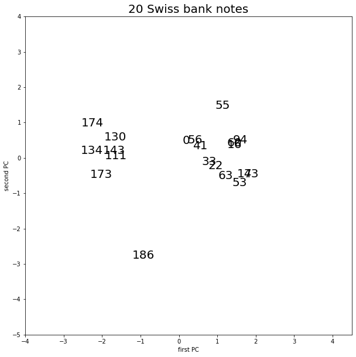
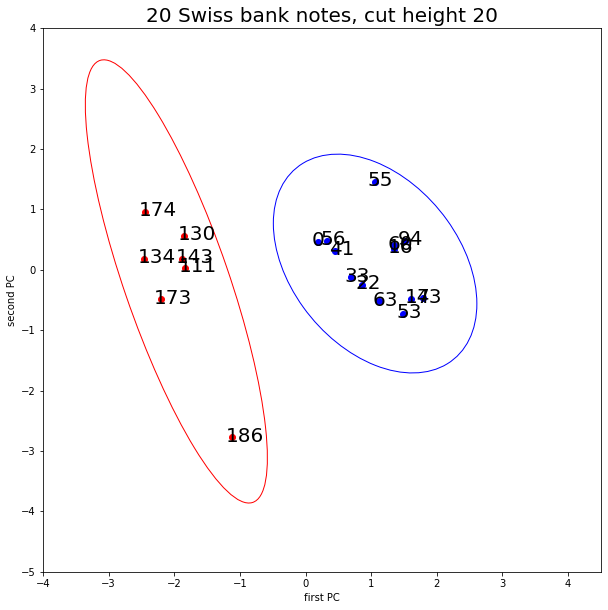
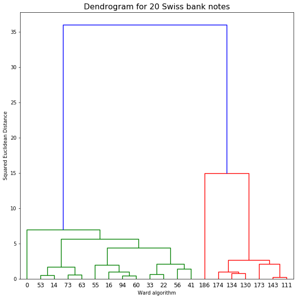

[](http://quantlet.de/)

## [](http://quantlet.de/) **Bank Cluster** [](http://quantlet.de/)

```yaml

Published in: 'SDA_2020_NCTU'

Name of QuantLet: 'Bank Cluster'

Description: 'PCA and a cluster analysis for 20 randomly chosen bank notes from the swiss bank notes dataset.'

Submitted: '4 January 2021'

Input: 'bank_data.txt'

Output: 'bankclust_1.png, bankclust_2.png, bankclust_3.png'

Keywords:
- Cluster-analysis
- Euclidean Distance
- Data Visualization
- Dendrogram
- Principal-components

Example : 
- 1. PCA for 20 randomly chosen bank notes. 
- 2. The dendrogram for the 20 bank notes after applying the Ward algorithm.
- 3. PCA with clusters

Author: Dwilaksana Abdullah Rasyid
```







### [IPYNB Code: Bank Cluster.ipynb](Bank Cluster.ipynb)


automatically created on 2021-01-04