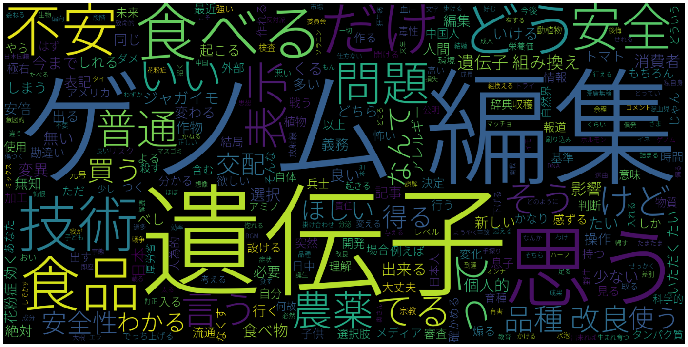

[](http://quantlet.de/)

## [](http://quantlet.de/) **NLP Japanese text from Yahoo** [](http://quantlet.de/)

```yaml

Published in: 'SDA_2020_NCTU'

Name of Quantlet : NLP Japanese text from Yahoo

Description :
- Preprocessing Japanese text from Yahoo
- Create a wordcloud based on the text

Keywords :
- Python
- Teaching
- Natural Language Processing
- Japanese Text
- Wordcloud
- Support vector machine
- Sentiment classification

Author : Junjie Hu, Dwilaksana
```



### PYTHON Code
```python

import os
import pandas as pd
from sudachipy import tokenizer, dictionary
# pip3 install SudachiPy if package not found
# CorePackage:
#pip install https://object-storage.tyo2.conoha.io/v1/nc_2520839e1f9641b08211a5c85243124a/sudachi/SudachiDict_core-20191030.tar.gz
# More information: https://github.com/WorksApplications/SudachiPy
from wordcloud import WordCloud, STOPWORDS
import matplotlib.pyplot as plt


def TokenCleanText(tker, mode, text):
    text = text.strip()
    tokenized_txt = [m.dictionary_form() for m in tker.tokenize(text, mode)]
    cleaned_txt = [word for word in tokenized_txt if word not in sw]
    return cleaned_txt

# Read and Pre-process Data
cwd = 'D:/S2/NCTU/smart data analytics 1/DigitalEconomyDecisionAnalytics-master/DEDA_NLP'
full_text = pd.read_csv(cwd +'/yahoo_jp.csv', sep=';')['text'].values


# Define Stopping Words
open(cwd +'/stopwords-ja.txt', 'r+') as sw_file
    sw = sw_file.read().splitlines()  # Define stop words and punctuation, not perfect!
sw.extend(['\n', '\n\n'])

# Tokenize Text
tk_obj = dictionary.Dictionary().create()
mode = tokenizer.Tokenizer.SplitMode.C
full_text_clean = [TokenCleanText(tk_obj, mode, text) for text in full_text]
clean_words = [word for txt in full_text_clean for word in txt]

# Create WordCloud
stopwords = set(STOPWORDS)
font_path = cwd + '/NotoSansCJKjp.otf'
plt.figure(figsize=(20, 10))
wordcloud = WordCloud(max_words=300, font_path=font_path,
                      stopwords=stopwords, width=1600,
                      height=800).generate(" ".join(clean_words))
plt.imshow(wordcloud)
plt.axis("off")
plt.tight_layout()
plt.show()
plt.savefig(cwd + '/DEDA_NLP/wordcloud_jp.png', dpi=300)


```

automatically created on 2020-11-19