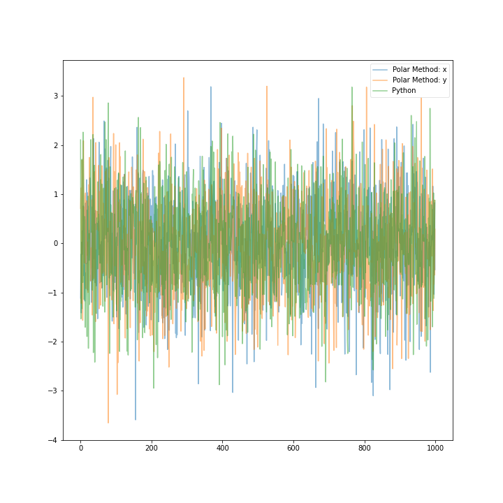

[](http://quantlet.de/)

## [](http://quantlet.de/) **Polar_coordinate_normal** [](http://quantlet.de/)

```yaml

Name of Quantlet: Polar_coordinate_normal

Published in:  SDA_2020_NCTU

Description: Create a function that can generate normal distribution from polar coordinate. The basic idea is from muller-box transformation.

Keywords: polar coordinate, exponential distribution, muller-box transform, normal distribution, generate

See also: FittingElephant
Author: Muhaimin 20201113
```




### PYTHON Code
```python

# -*- coding: utf-8 -*-
"""Polar_coordinate_normal.ipynb

Automatically generated by Colaboratory.

Original file is located at
    https://colab.research.google.com/drive/10vv4zHjyt6VW4iOS7PnrGJWmtnpFhFFz
"""

import numpy as np
import matplotlib.pyplot as plt
from scipy import stats

def generate_normal(n):
  u1 = np.random.uniform(0,1,n)
  u2 = np.random.uniform(0,1,n)
  u3 = np.random.uniform(0,1,n)
  u4 = np.random.uniform(0,1,n)
  r1 = np.sqrt(-2*np.log(u1))
  r2 = np.sqrt(-2*np.log(u3))
  theta1 = 2*np.pi*u2
  theta2 = 2*np.pi*u4
  x = r1*np.cos(theta1)
  y = r2*np.sin(theta2)
  result = np.append(x, [y])
  return result, x, y
result = generate_exponential(1000)
real = np.random.normal(loc=0, scale=1, size=1000) #brenchmark

#line plot to compare with brenchmark
plt.figure(figsize=(10,10))
plt.plot(result[1], label = 'Polar Method: x', alpha = 0.5)
plt.plot(result[2], label = 'Polar Method: y', alpha = 0.5)
plt.plot(real, label="Python", alpha=0.5)
plt.legend(fancybox=True, framealpha = 0.5)
plt.savefig('compare.png', transparent=True)

#density plot compare with brenchmark
plt.figure(figsize=(10,10))
plt.hist(result[1], edgecolor='black', bins=int(180/5), alpha=0.3, density=True, label = 'Polar Coordinate: x')
plt.hist(result[2], edgecolor='black', bins=int(180/5), alpha=0.3, density=True, label = 'Polar Coordinate: y')
plt.hist(real, edgecolor='black', bins=int(180/5), alpha=0.3, density=True, label = 'Python')
plt.legend(fancybox=True, framealpha=0.5)
plt.savefig("density.png", transparent=True)

print(stats.kstest(result[1], 'norm')) #KStest for x
print(stats.kstest(result[2], 'norm')) #KStest for y
```

automatically created on 2020-11-18