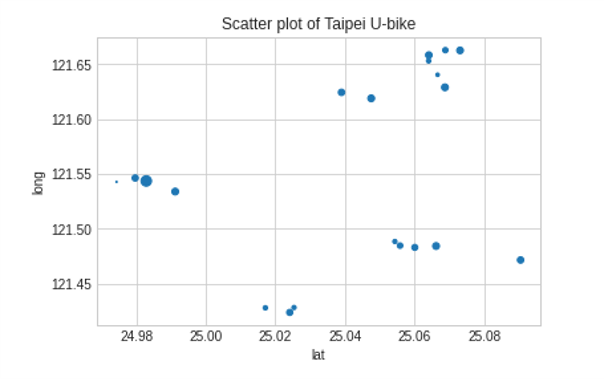

[](http://quantlet.de/)

## [](http://quantlet.de/) **SDA_20201023_hw3_Ubike_Station** [](http://quantlet.de/)

```yaml

Name of Quantlet : 'SDA_20201023_hw3_Ubike_Station'

Published in: 'SDA_2020_NCTU'

Description : Mapping the u-bike station in Taipei with the number of u-bike left at that station.

Submitted : 23 October 2020

Input: json format (crawling from URL directly)

Output:  Scatter plot and the map of ubike station with Longitude and Latitude

Keywords : 
- Web Crawling
- Ubike Station
- Taipei Map
- online JSON data
- Mapping


Author : Andreas Rony Wijaya, NCTU
```

