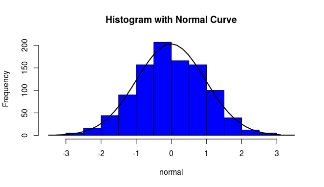
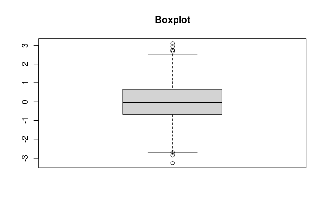

[](http://quantlet.de/)

## [](http://quantlet.de/) **SDA_20201031_hw4_Cutoffpoint** [](http://quantlet.de/)

```yaml

Name of Quantlet: 'SDA_20201031_hw4_Cutoffpoint'

Published in: 'SDA_2020_NCTU'

Description: 'Calculating the probability of a “normal (distribution)” to be outside the upper cutoff point'

Submitted:  31 October 2020

Input: 

Output:  'Histogram, Quantitle of 25% and 75%, Upper cut off point, boxplot, and proability of data outside upper cut off point'

Keywords:
- upper cut off point
- Normal distribution
- Outliers
- Quantile
- Boxplot


Author: Andreas Rony Wijaya

```





### R Code
```r

#Generate random number from normal distribution
set.seed(1357)
n=1000
normal = rnorm(n)

#histogram and its density
h <- hist(normal, breaks=10, col="blue",
     main="Histogram with Normal Curve")
xfit <- seq(min(normal), max(normal), length = 40) 
yfit <- dnorm(xfit, mean = mean(normal), sd = sd(normal)) 
yfit <- yfit * diff(h$mids[1:2]) * length(normal) 

lines(xfit, yfit, col = "black", lwd = 2)


# 25% quantile
q25 <- as.numeric(quantile(normal, probs =0.25))

# 75% quantile
q75 <- as.numeric(quantile(normal, probs =0.75))

#upper cut off point
w = q75 + 1.5 *(q75-q25)
cat("The cut off point is: ", w)

#Boxplot of the data
boxplot(normal, main="Boxplot")

# CDF with x=w
phi<- pnorm(w, mean = 0, sd = 1)

# Calculate the probability of a “normal (distribution)” to be outside the upper cutoff point
p = 2*(1-phi)
cat("The probability of a “normal (distribution)” to be outside the upper cutoff point: ", p)


```

automatically created on 2020-11-18

### PYTHON Code
```python

#!/usr/bin/env python
# coding: utf-8

# In[1]:


import matplotlib.pyplot as plt
import numpy as np
import pylab


# In[2]:


mu= 0
sigma = 1
number = 100000


# In[3]:


dataset = np.random.normal(mu, sigma, number)


# In[4]:


count, bins, ignored=plt.hist(dataset, 50, density=True)
plt.plot(bins, 1/(sigma * np.sqrt(2*np.pi))*np.exp(-(bins-mu)**2/(2*sigma**2)), linewidth=2, color='y')
plt.show()


# In[5]:


q25= np.quantile(dataset, 0.25)
q75= np.quantile(dataset, 0.75)


# In[6]:


print("\nQuantile 25%: ", q25)
print("\nQuantile 75%: ", q75)


# In[7]:


w=q75+1.5*(q75-q25)
print("\nUpper cut off point: ", w)


# In[8]:


pylab.rcParams['figure.figsize']=(9.0,6.0)


# In[9]:


plt.boxplot(dataset)
plt.ylabel(("values"))
plt.title("Boxplot")


# In[10]:


from scipy import stats
phi = stats.norm.cdf(w, loc=0, scale=1)
print("cdf of w is: ", phi)


# In[11]:


p=2*(1-phi)
print("probability of data outside the upper cut point= ", p)


# In[ ]:


```

automatically created on 2020-11-18