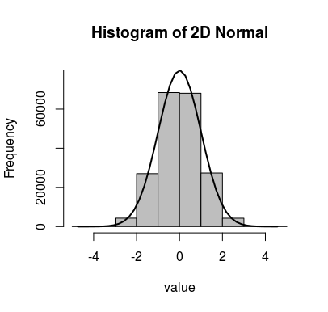

[](http://quantlet.de/)

## [](http://quantlet.de/) **SDA_20201112_hw6_2D Normal Dist** [](http://quantlet.de/)

```yaml

Name of Quantlet: 'SDA_20201112_hw6_2D Normal Dist'

Published in: 'SDA_2020_NCTU'

Description: 'Generating 2D Normal Distribution with Polar Coordinates'

Submitted:  '12 Nov 2020'

Datafile: 

Keywords: 
- Two Dimension
- Normal
- Uniform
- Exponential
- Box-muller

Input:

Output:  'Histogram_2dnorm.png'

Author: 'Andreas Rony Wijaya'

```

