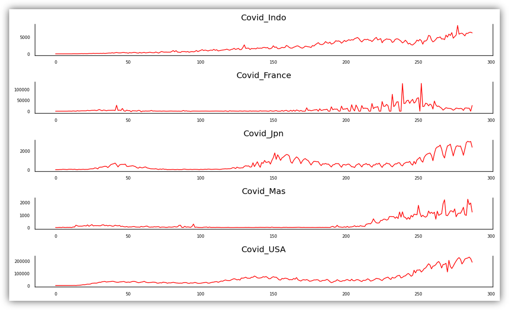
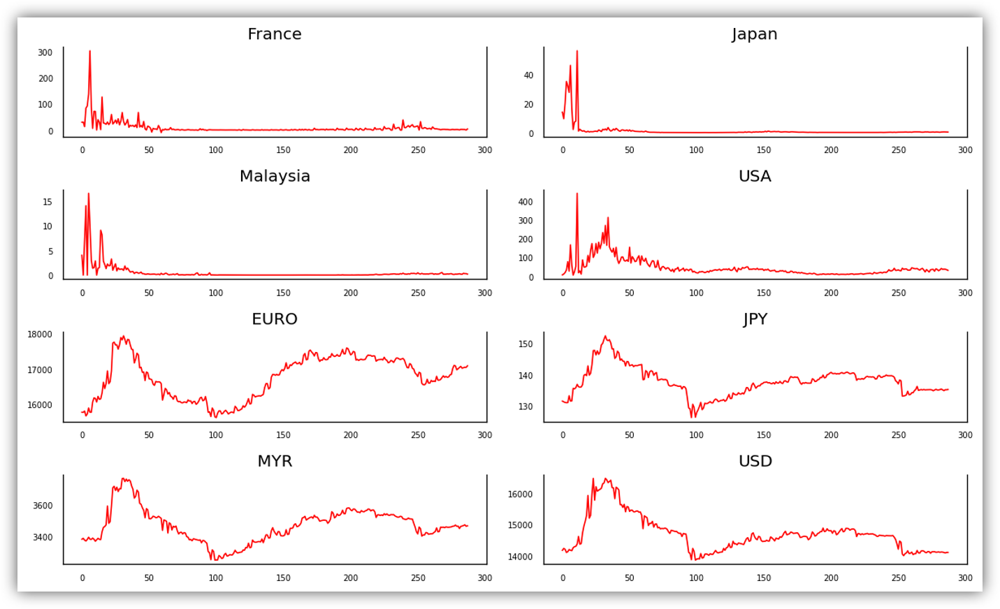

[](http://quantlet.de/)

## [](http://quantlet.de/) **Granger_Causality** [](http://quantlet.de/)

```yaml

Name of Quantlet: 'Granger_Causality'

Published in: 'SDA_2020_NCTU'

Description: 'Test for Granger causality among series'

Submitted:  '18 November 2020'

Input: 'SDA_data.csv'

Output:  'CovidRatio_ExchangeRate.png, Covid-19.png'

Keywords:
- LSTM
- Exchange Rate
- Granger Causality
- Covid-19
- Currency

Author: Samingun Handoyo, Andreas Rony Wijaya

```





### PYTHON Code
```python

import pandas as pd
import numpy as np
from statsmodels.tsa.api import VAR
from statsmodels.tsa.stattools import adfuller
from statsmodels.tools.eval_measures import rmse, aic
from statsmodels.tsa.stattools import grangercausalitytests
from statsmodels.tsa.vector_ar.vecm import coint_johansen
import matplotlib.pyplot as plt
maxlag=12
test = 'ssr_chi2test'
def grangers_causation_matrix(data, variables, 
                              test='ssr_chi2test', verbose=False):    
    df = pd.DataFrame(np.zeros((len(variables), len(variables))), 
                      columns=variables, index=variables)
    for c in df.columns:
        for r in df.index:
            test_result = grangercausalitytests(data[[r, c]], maxlag=maxlag, verbose=False)
            p_values = [round(test_result[i+1][0][test][1],4) for i in range(maxlag)]
            if verbose: print(f'Y = {r}, X = {c}, P Values = {p_values}')
            min_p_value = np.min(p_values)
            df.loc[r, c] = min_p_value
    df.columns = [var + '_x' for var in variables]
    df.index = [var + '_y' for var in variables]
    return df

def cointegration_test(df, alpha=0.05): 
    """Perform Johanson's Cointegration Test and Report Summary"""
    out = coint_johansen(df,-1,5)
    d = {'0.90':0, '0.95':1, '0.99':2}
    traces = out.lr1
    cvts = out.cvt[:, d[str(1-alpha)]]
    def adjust(val, length= 6): return str(val).ljust(length)

    # Summary
    print('Name   ::  Test Stat > C(95%)    =>   Signif  \n', '--'*20)
    for col, trace, cvt in zip(df.columns, traces, cvts):
        print(adjust(col), ':: ', adjust(round(trace,2), 9), ">", adjust(cvt, 8), ' =>  ' , trace > cvt)

def covid_ratio(data):
    n_sample = len(data[:,1])
    temp = np.zeros((n_sample,4))
    for j in range(4):
        for i in range(n_sample):
            if data[i,0]==0:
                temp[i,j]=data[i,j+1]
            else:
                temp[i,j]=data[i,j+1]/data[i,0]
    return temp

# read data
filepath = 'https://raw.githubusercontent.com/selva86/datasets/master/Raotbl6.csv'
DF = pd.read_csv('C:/Users/user/Documents/Kuliah/SDA/grangers_test/SDA_data.csv')
print(DF.columns)
df = DF.iloc[:,1:6]

fig, axes = plt.subplots(nrows=5, ncols=1, dpi=120, figsize=(10,6))
for i, ax in enumerate(axes.flatten()):
    data = df[df.columns[i]]
    ax.plot(data, color='red', linewidth=1)
    # Decorations
    ax.set_title(df.columns[i])
    ax.xaxis.set_ticks_position('none')
    ax.yaxis.set_ticks_position('none')
    ax.spines["top"].set_alpha(0)
    ax.tick_params(labelsize=6)
plt.tight_layout();
#plot for the Exchange rates
ndarr=np.array(df)
covid_ra = covid_ratio(ndarr)
colnames = ["Ratio France", "Ratio Japan","Ratio Malaysia","Ratio USA"]
DF_ra = pd.DataFrame(covid_ra)
DF_ra.columns=colnames
print(DF_ra.tail())
nd1 = np.array(DF_ra)
nd2 = np.array(DF.iloc[:,6:])
nd_g = np.hstack((nd1,nd2))
df_g = pd.DataFrame(nd_g)
colnames = ["France", "Japan","Malaysia","USA","EURO","JPY","MYR","USD" ]
df_g.columns=colnames
print(df_g.tail())
df=df_g
fig, axes = plt.subplots(nrows=4, ncols=2, dpi=120, figsize=(10,6))
for i, ax in enumerate(axes.flatten()):
    data = df[df.columns[i]]
    ax.plot(data, color='red', linewidth=1)
    # Decorations
    ax.set_title(df.columns[i])
    ax.xaxis.set_ticks_position('none')
    ax.yaxis.set_ticks_position('none')
    ax.spines["top"].set_alpha(0)
    ax.tick_params(labelsize=6)
plt.tight_layout();

grangers_out = grangers_causation_matrix(df_g, variables = df_g.columns) 
df_out=grangers_out.iloc[4:,:]
print(df_out)
coit_test = cointegration_test(df_g)
print(coit_test)
```

automatically created on 2021-01-08