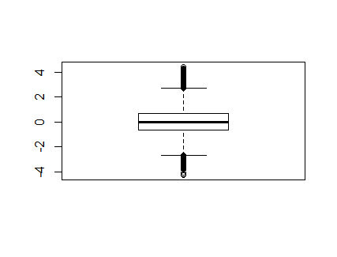

[](http://quantlet.de/)

## [](http://quantlet.de/) **Upper Cutoff point** [](http://quantlet.de/)

```yaml

Published in: 'SDA_2020_NCTU'

Name of Quantlet: 'Upper Cutoff point'

Description: 'Calculating the probability upper cutoff point of normal standard distribution'

Output:  'Histogram, Quantitle of 25% and 75%, Upper cut off point, boxplot, and proability of data outside upper cut off point'

Keywords:
- Upper cut off point
- Normal distribution
- Quantile
- Boxplot
- Histogram

Author: Dwilaksana
```

