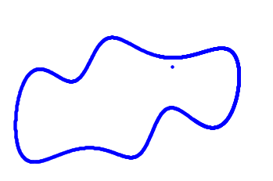

[](http://quantlet.de/)

## [](http://quantlet.de/) **drawing_animal** [](http://quantlet.de/)

```yaml

Name of Quantlet : drawing_animal

Published in :  SDA_2020_NCTU

Description :  
- Use complex numbers as parameters to fit animal that can move 
- I choose to draw a Happy Hippo that can move his nose and output the results as .mp4 file.

Keywords : 
- Complex analysis
- Fourier Transform
- Moving animal
- Happy Hippo

Author : Huong Vu 0856156

```



### [IPYNB Code: drawing_animal.ipynb](drawing_animal.ipynb)


automatically created on 2020-11-09