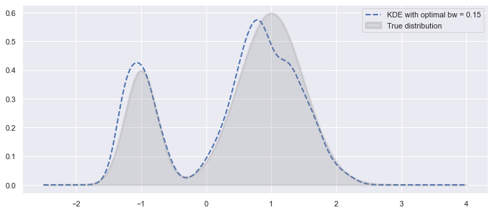
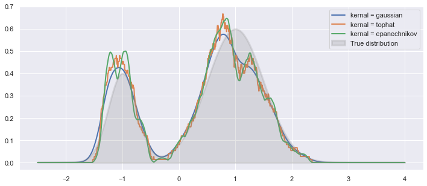

[](http://quantlet.de/)

## [](http://quantlet.de/) **kernel_density_estimation** [](http://quantlet.de/)

```yaml

Name of Quantlet : kernel_density_estimation

Published in :  SDA_2020_NCTU

Description :  Kernel Density Estimation Using Scikit-Learn

Keywords : 
- kernel density estimation
- probability density function
- non-parametric method
- normal distribution
- distribution analysis

Author : Huong Vu 0856156

```






### [IPYNB Code: kernel_density_estimation.ipynb](kernel_density_estimation.ipynb)


automatically created on 2020-12-01