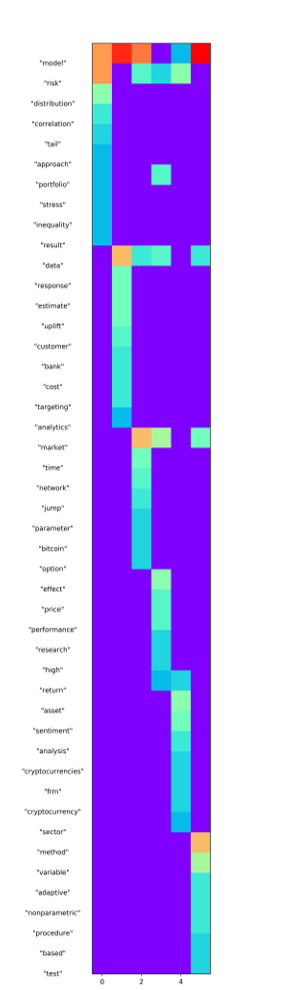
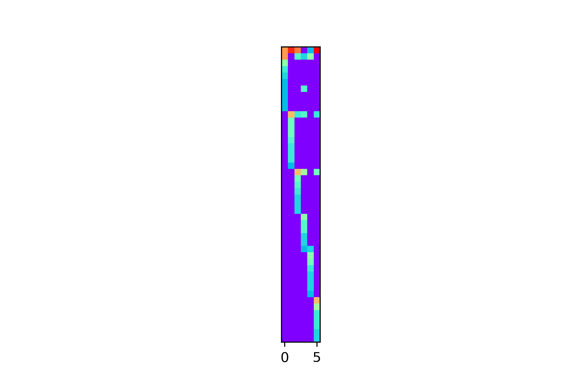
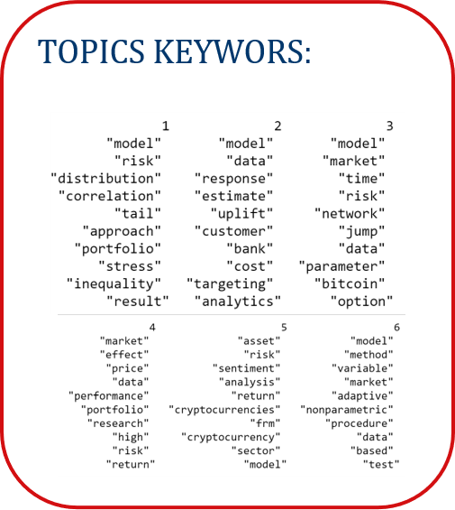

[](http://quantlet.de/)

## [](http://quantlet.de/) **lda_analysis** [](http://quantlet.de/)

```yaml

Name of Quantlet : lda_analysis
Published in :  SDA_2020_NCTU

Description :  perform LDA Analysis on given dataset

Keywords : 
- LDA Analysis
- Topic Modelling
- Heatmap


Author : Huong Vu 0856156
```







### [IPYNB Code: lda_analysis.ipynb](lda_analysis.ipynb)


automatically created on 2020-11-06