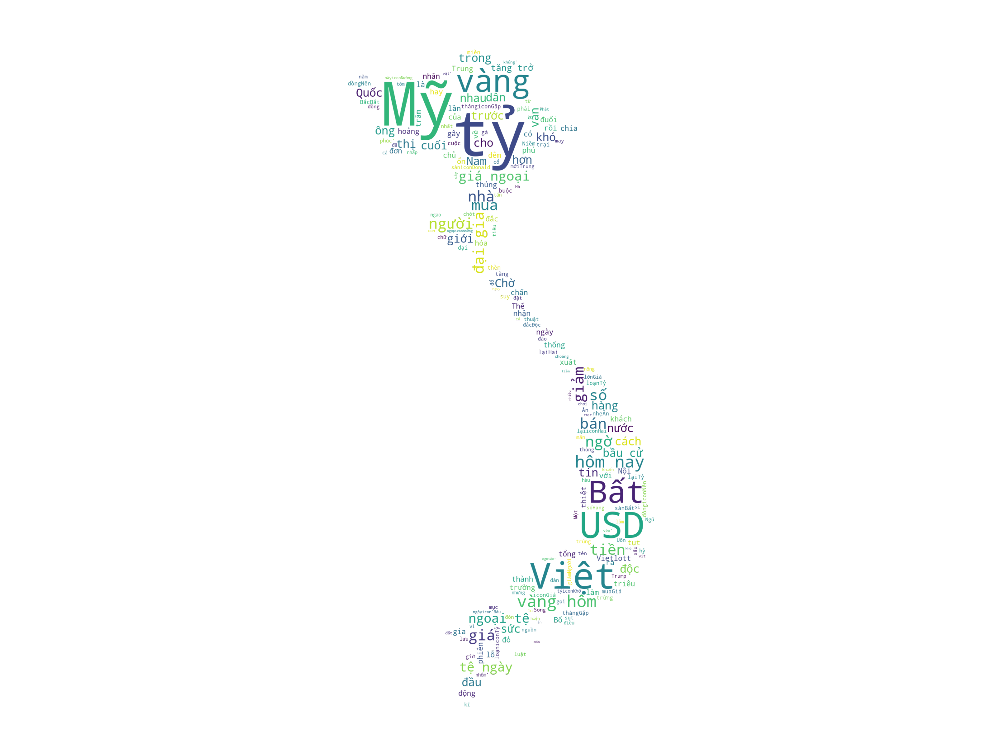
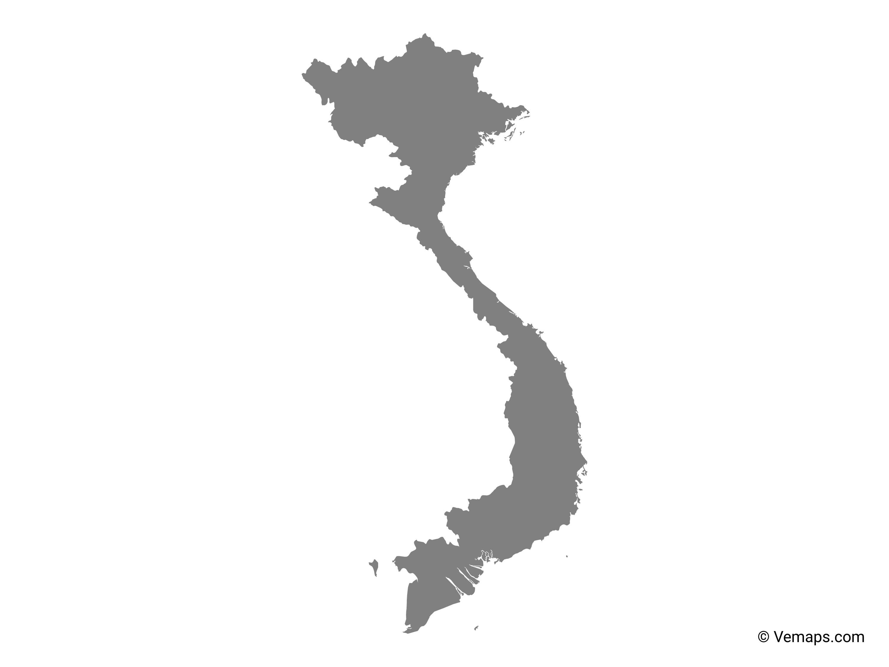

[](http://quantlet.de/)

## [](http://quantlet.de/) **vietnam_news_webscap** [](http://quantlet.de/)

```yaml

Name of Quantlet : vietnam_news_webscap

Published in :  SDA_2020_NCTU

Description : simple web-scraping on vietnam.net 
Keywords : 
- web-scaping
- Vietnam news
- Wordcloud
- finance news
- text mining


Author : Huong Vu 0856156

```



